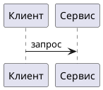

# Smalum

**Превью диаграмм как код** — PlantUML, Mermaid, BPMN, DFD, Struct, SQL→ER — прямо в markdown.

## Боль

Схему пишут текстом: быстро, в git, рядом с кодом. Картинку автолейаут портит. Довели вид вручную — поправили строку исходника — раскладка сгорела.

Визуальный редактор сохраняет вид, но убивает «схему как код»: файл перестаёт быть источником правды.

## Решение

Smalum: **текст = состав**, **мышь = вид**. Вид пишется обратно в тот же файл оверлеем `SM:` (координаты в комментариях). Следующий разбор берёт состав из кода, картинку — из оверлея.

Этот плагин — **read-only превью** того же разбора и того же оверлея, что в редакторе. Вставили блок исходника в `.md` — схема рисуется с вашей раскладкой. Любая поддерживаемая нотация из кода, не «одна картинка снаружи».

Также: fence `sm` / `smalum` в Markdown, файлы `.sm` и PlantUML (`.puml` / `@startuml`). Команда **Smalum: Preview** — фигуры и оверлей как в [app.smalum.ru](https://app.smalum.ru).

## Умеет / не умеет

| Умеет | Не умеет (намеренно) |
|-------|----------------------|
| Разбор PlantUML, Mermaid, DFD, BPMN, Struct, SQL→ER | Редактирование холста мышью |
| Отрисовка с оверлеем `SM:` / `%% SM:` | Облако, шаринг, симулятор BPMN |
| Превью в markdown / `.sm` без сети на `*.smalum.ru` | Запись оверлея из превью |

Полноценный холст, облако и гостевой редактор — на [app.smalum.ru](https://app.smalum.ru). Плагин и сайт говорят на одном языке и одном оверлее.

## Нотации

| Нотация | Вход |
|---------|------|
| BPMN | `//smalum/bpmn` |
| DFD | `//smalum/dfd` |
| Struct | `//smalum/struct`, `struct/staff` |
| PlantUML | `@startuml` |
| Mermaid | `flowchart`, `sequenceDiagram`, … + `%% SM:` |
| SQL→ER | `CREATE TABLE` |

## Установка

Из VS Code / Cursor Marketplace: **Smalum Preview** (`Smalum.smalum`).  
Cursor / VSCodium: Open VSX `smalum.smalum`.  
Или `.vsix` с [GitHub Releases](https://github.com/smalum/vscode/releases).

## Ссылки

- Сайт: [smalum.io](https://smalum.io)
- Редактор: [app.smalum.ru](https://app.smalum.ru)
- Документация: [docs.smalum.ru](https://docs.smalum.ru)
- Файл роли для LLM: [docs.smalum.ru/role.md](https://docs.smalum.ru/role.md)

**Small language. Sharp diagrams.**
